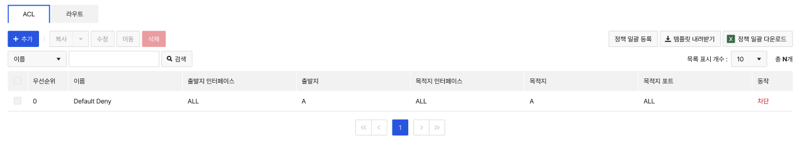
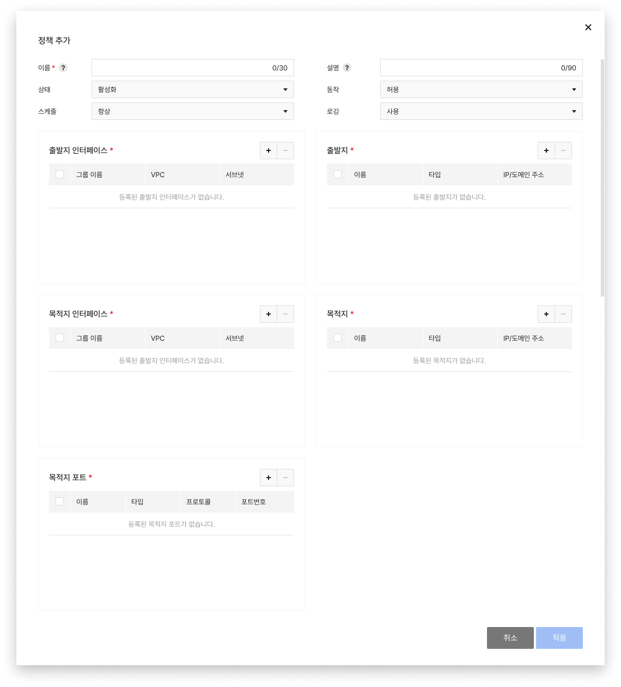
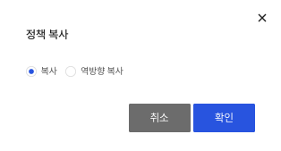
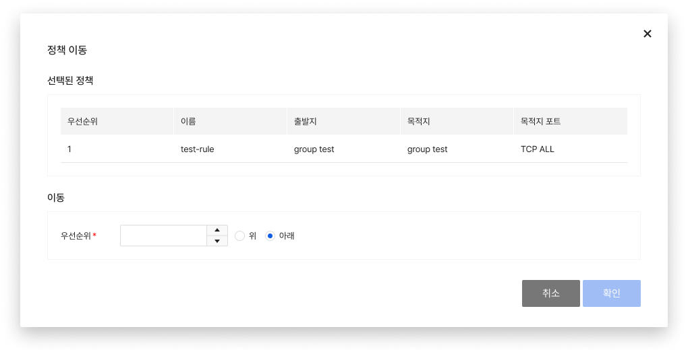
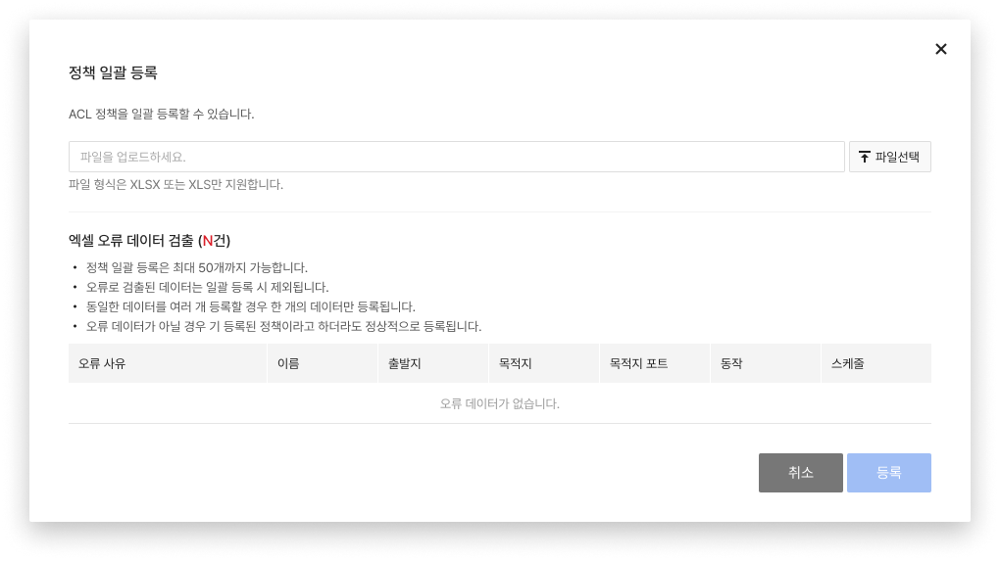

## 정책

**Security > Network Firewall > 콘솔 사용 가이드 > 정책**

**정책** 탭에서는 Network Firewall과 연결된 VPC 간 트래픽과 인바운드/아웃바운드 트래픽을 제어할 수 있는 **ACL**과 Network Firewall을 경유하는 통신의 경로를 지정할 수 있는 **라우트** 기능을 사용할 수 있습니다.

 

## ACL 설정하기

### 추가

* 출발지, 목적지, 목적지 포트를 기반으로 정책을 추가할 수 있습니다.
    * 이미 만들어진 객체를 통해 출발지, 목적지, 목적지 포트를 선택합니다.
* 정책의 상태(활성화/비활성화)와 동작(허용/차단), 스케줄을 설정 및 정책별 로깅 여부 등의 옵션을 설정하여 정책을 추가할 수 있습니다.
* 스케줄 기능은 정책의 상태를 활성화한 이후에 동작합니다(정책이 비활성화되어 있을 경우 스케줄 기능이 적용되지 않습니다.).

### 복사

* **복사**를 클릭해 정책을 복사할 수 있습니다.
    * 복사: 복사하고자 하는 정책과 동일한 정책을 복사
    * 역방향 복사: 복사하고자 하는 정책의 출발지와 목적지를 변경하여 복사
    
    
### 수정

* **수정**을 클릭해 정책을 수정할 수 있습니다.

### 이동

* **이동**을 클릭해 정책을 이동할 수 있습니다.
    * default-deny 정책 아래로는 이동이 불가능합니다.
    

### 삭제

* **삭제**를 클릭해 정책을 삭제할 수 있습니다.

### 정책 일괄 다운로드

* 정책 탭에 생성되어 있는 정책 전체를 한 번에 다운로드할 수 있습니다.

### 정책 일괄 등록

* 내려받은 템플릿을 사용하여 정책을 한 번에 등록할 수 있습니다.

!!! tip "알아두기"

    복사된 정책은 비활성화됩니다. 사용이 필요할 경우 **수정**을 클릭해 정책을 활성화한 뒤 사용하세요.

!!! danger "주의"
    한 번 삭제한 정책은 복구할 수 없으며, default-deny 정책은 삭제할 수 없습니다.

 

## 라우트 설정하기

### 추가

* **추가**를 클릭해 이더넷을 선택하고, 목적지와 게이트웨이를 입력합니다. 
    * 목적지: 서브넷 형식으로 입력
    * 이더넷: 드롭다운 목록에 노출되는 이더넷 선택
    * 게이트웨이: 호스트 형식으로 입력
  
### 수정

* **수정**을 클릭해 라우트를 수정할 수 있습니다.

### 삭제

* **삭제**를 클릭해 라우트를 삭제할 수 있습니다.

!!! tip "알아두기"

    * 이더넷을 VPN으로 선택할 경우 게이트웨이는 지정하지 않아도 됩니다.
    * IPSec VPN과 연동된 사설 IP 대역에 대한 라우트 설정은 반드시 이더넷을 VPN으로 설정하세요.
    * 목적지 서브넷 입력 시 아래와 같은 유효성 메시지가 노출될 경우 서브넷 범위를 사전에 확인하여 서브넷의 시작 IP로 입력하세요.
        * [예시]
            * 192.168.199.0/21 (X) → 192.168.192.0/21 (O)
            * 172.16.100.0/20 (X) → 172.16.96.0/20 (O)
            * 10.10.10.130/25 (X) → 10.10.10.128/25 (O)
            

!!! danger "주의"

    * Network Firewall의 기본 게이트웨이는 NAT 이더넷이며, 수정하거나 삭제할 수 없습니다.
    * 라우트 설정이 변경될 경우 통신에 문제가 있을 수 있으므로 유의하여 설정하세요. 