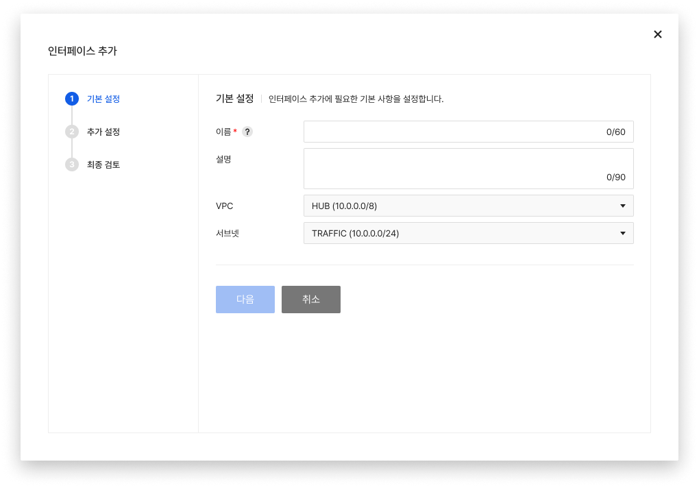
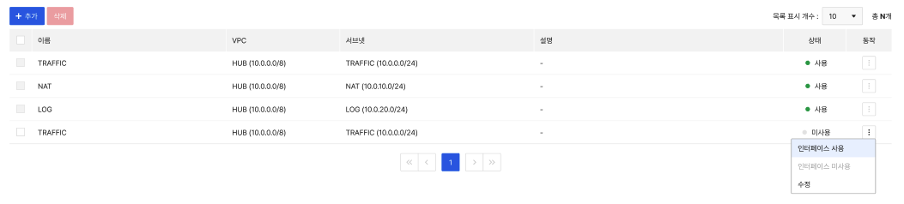

<!-- pre-align:aligned sig=b90768e8e6c9 -->

## 인터페이스 { #interface }

**Security > Network Firewall > 콘솔 사용 가이드 > 인터페이스**

**인터페이스** 탭에서는 Network Firewall에 사용할 인터페이스를 생성하고 관리합니다.

 

## 인터페이스 설정하기 { #configure-interface }

### 추가 { #add }
* **추가**를 클릭해 인터페이스를 추가합니다.
    * 이름을 입력하고, VPC, 서브넷을 선택합니다.
    

### 수정 { #modify }
* **수정**을 클릭해 인터페이스를 수정할 수 있습니다.
    * VPC와 서브넷은 수정이 불가능합니다.

### 삭제 { #delete }
* **삭제**를 클릭해 인터페이스를 삭제할 수 있습니다.

### 사용 설정 { #enabledisable }
* 오버플로우 메뉴에서 인터페이스를 사용 또는 미사용으로 설정할 수 있습니다.

!!! tip "알아두기"

    수정은 이름과 설명만 수정 가능합니다.

!!! danger "주의"
    
    * 사용 중인 인터페이스는 삭제할 수 없습니다.
        * ACL 및 라우트 설정에 해당 인터페이스가 없고, 인터페이스 탭에서 미사용 상태여야만 삭제  가능합니다.
    * 현재 사용 중인 인터페이스를 '미사용'으로 설정 시 통신에 영향을 받을 수 있습니다.
    * 성된 인터페이스 정보는 [Network > Network Interface]에서 확인할 수 있습니다.
        * Network Firewall에서 생성한 Virtual_IP 타입 인터페이스를 수정할 경우 미사용 상태의 인터페이스는 사용할 수 없게 되며, 이미 사용 중인 인터페이스는 통신에 영향을 받을 수 있습니다.