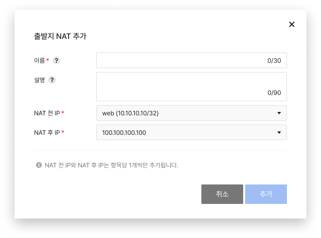
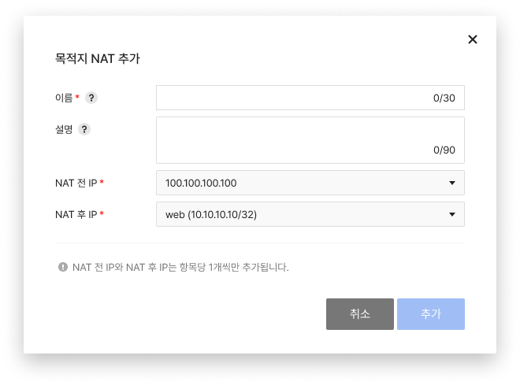

<!-- pre-align:aligned sig=b5a6dd9155ad -->

## NAT { #nat }

**Security > Network Firewall > 콘솔 사용 가이드 > NAT**

**NAT**(네트워크 주소 변환) 탭에서는 인스턴스가 외부와 통신할 때 외부에 노출되는 공인 IP를 설정하는 출발지 NAT와 외부에서 접속할 인스턴스와 전용으로 사용할 공인 IP를 선택하여 연결하는 목적지 NAT를 설정할 수 있습니다.

 

## 출발지 NAT 설정하기 { #configure-source-nat }

### 추가 { #add }

* **추가**를 클릭해 출발지 NAT를 생성합니다.
    * NAT 전 IP에서 선택할 객체는 **객체** 탭에서 미리 생성해야만 **추가**를 클릭해 추가할 수 있습니다.
    * NAT 후 IP는 **Network > Floating IP**에서 미리 생성한 IP 중 하나를 선택합니다. 

### 수정 { #modify }

* **수정**을 클릭해 생성된 출발지 NAT를 수정합니다.
    * 수정은 공인 IP와 사설 IP 모두 수정할 수 있습니다.

### 삭제 { #delete }

* **삭제**를 클릭해 생성된 출발지 NAT를 삭제합니다.

 

## 목적지 NAT 설정하기 { #configure-destination-nat }

### 추가 { #configure-destination-nat-add }

* **추가**를 클릭해 목적지 NAT를 생성합니다.
    * NAT 전 IP는 **Network > Floating IP**에서 미리 생성한 IP 중 하나를 선택합니다.  
    * NAT 후 IP에서 선택할 객체는 **객체** 탭에서 미리 생성해야만 **추가**를 클릭해 추가할 수 있습니다.

### 수정 { #configure-destination-nat-modify }

* **수정**을 클릭해 생성된 목적지 NAT를 수정합니다.
    * 수정은 공인 IP와 사설 IP 모두 수정할 수 있습니다.

### 삭제 { #configure-destination-nat-delete }

* **삭제**를 클릭해 생성된 목적지 NAT를 삭제합니다.

!!! tip "알아두기"
    * 포트 기반의 목적지 NAT는 제공하지 않습니다.
    * NAT를 생성한 뒤 **정책** 탭에 허용 정책을 추가해야만 공인 통신이 가능합니다.
    * 인스턴스 접속은 목적지 탭에 NAT를 추가하면서 설정한 NAT 전 IP로 접속할 수 있습니다. (인스턴스에 직접 Floating IP 연결 불필요)
    * NAT에 설정된 NAT 후 IP를 소유한 인스턴스에 직접 Floating IP를 할당할 경우 통신에 문제가 있을 수 있습니다.
    * NAT 삭제 후 사용하지 않는 NAT 전 IP는 **Network > Floating IP**에서 직접 삭제하세요.