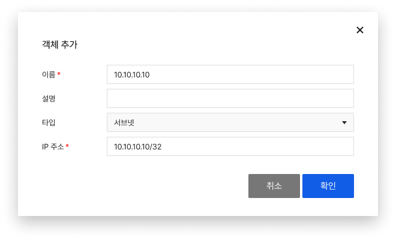
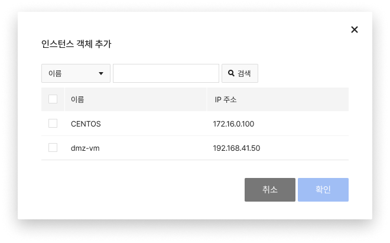

<!-- pre-align:aligned sig=61dff5f1b687 -->

## 객체 { #object }

**Security > Network Firewall > 콘솔 사용 가이드 > 객체**

**객체** 탭에서는 정책을 생성할 때 사용할 IP, 포트를 생성하고 관리합니다.

 

## 객체 설정하기 { #configure-objects }

### 추가 { #add }

* 필수 항목을 입력하여 객체를 생성합니다.
    * 객체는 IP, 포트의 2가지 형태로 추가할 수 있습니다.
    

### 수정 { #modify }

* **수정**을 클릭해 객체를 수정할 수 있습니다.
    * 타입은 수정이 불가능합니다.

### 삭제 { #delete }

* **삭제**를 클릭해 객체를 삭제할 수 있습니다.
    * 자동으로 Network Firewall에서 생성한 객체는 수정이나 삭제할 수 없습니다.

### 인스턴스 객체 추가 { #add-instance-object }
* Network Firewall이 생성된 프로젝트 내에 있는 인스턴스를 활용하여 객체를 추가할 수 있습니다.

### 객체 일괄 다운로드 { #batch-download-of-objects }

* **객체** 탭에 생성되어 있는 IP와 포트 객체 전체를 각각 한 번에 다운로드할 수 있습니다.

!!! tip "알아두기"
    * 그룹 객체 생성 시 그룹 객체는 추가할 수 없습니다(단일이나 범위 객체만 선택하여 추가 가능).
    * 인스턴스와 관계없이 단순히 인스턴스의 이름과 사설 IP 주소만 참고하여 객체를 생성합니다. 생성한 객체는 **객체** 탭에서 관리합니다.

!!! danger "주의"
    정책에서 사용 중인 객체는 삭제 후 ALL 객체로 변경됩니다.